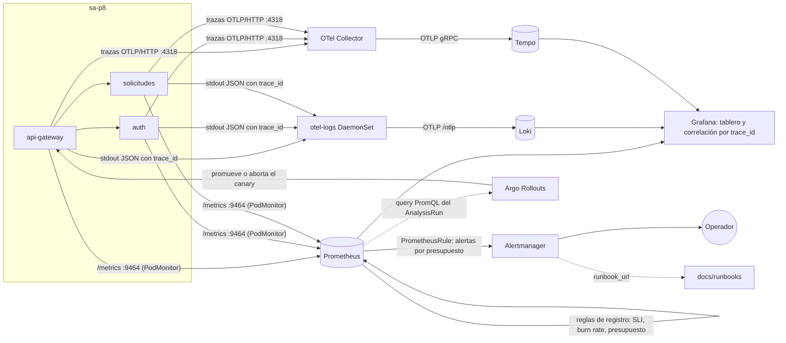

# Diagrama del flujo de telemetría

```mermaid
flowchart LR
  subgraph sa-p8
    GW[api-gateway] --> AU[auth]
    GW --> SO[solicitudes]
  end
  GW & AU & SO -- "trazas OTLP/HTTP :4318" --> COL[OTel Collector]
  COL -- "OTLP gRPC" --> TEMPO[(Tempo)]
  GW & AU & SO -- "stdout JSON con trace_id" --> AGT[otel-logs DaemonSet]
  AGT -- "OTLP /otlp" --> LOKI[(Loki)]
  GW & AU & SO -- "/metrics :9464 (PodMonitor)" --> PROM[(Prometheus)]
  PROM -- "reglas de registro: SLI, burn rate, presupuesto" --> PROM
  PROM -- "PrometheusRule: alertas por presupuesto" --> AM[Alertmanager] --> OP((Operador))
  PROM -. "query PromQL del AnalysisRun" .-> ROL[Argo Rollouts]
  ROL -- "promueve o aborta el canary" --> GW
  PROM & LOKI & TEMPO --> GRAF[Grafana: tablero y correlación por trace_id]
  AM -. runbook_url .-> RB[docs/runbooks]
```
